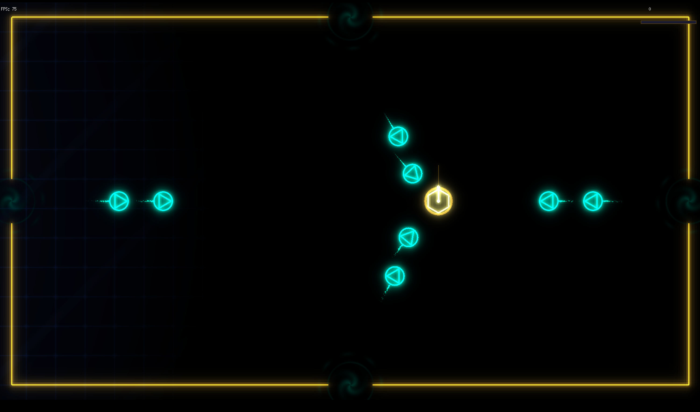

# dFender

Top-down 2D arena shooter written in Go with [Ebitengine](https://ebitengine.org/). Defend against waves of enemies pouring through four gates. Newtonian physics, a freely rotating turret, and art deco visuals with bloom and shader effects.

Concept copied from Stardew Valley arcade.



No external assets — all graphics are procedural (vector shapes + Kage shaders).

## Controls

- **WASD** — thrust (Newtonian — you drift, brake yourself)
- **Arrow keys** — rotate turret
- **Space** — fire (overheats)

Hit a wall too fast and you die. Touch an enemy and you die.

## Build & Run

```
go run .
```

Requires Go 1.26+ and the Ebitengine dependencies for your platform (see [Ebitengine install guide](https://ebitengine.org/en/documents/install.html)).

## License

Apache Public License 2.0
